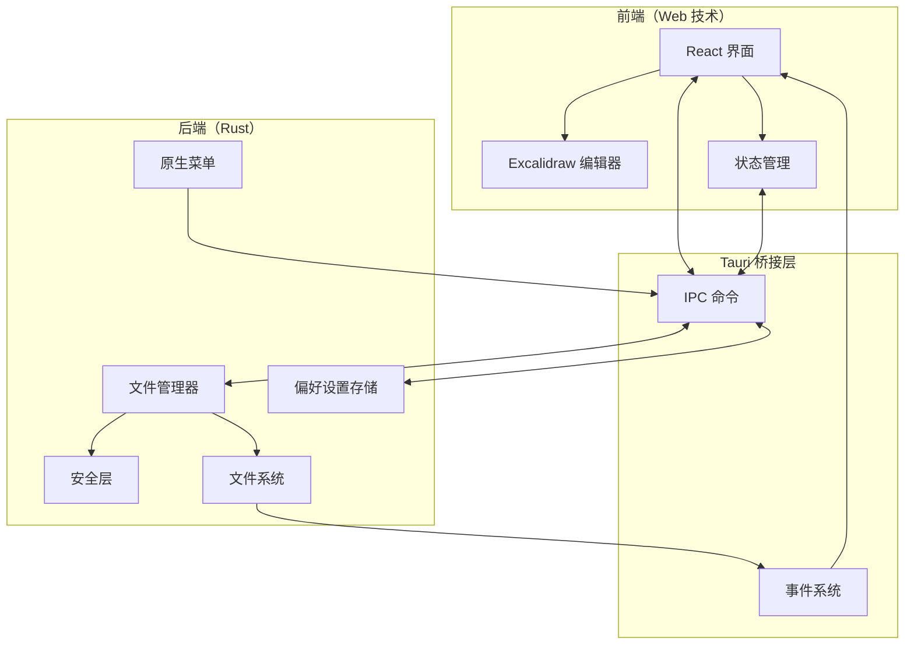
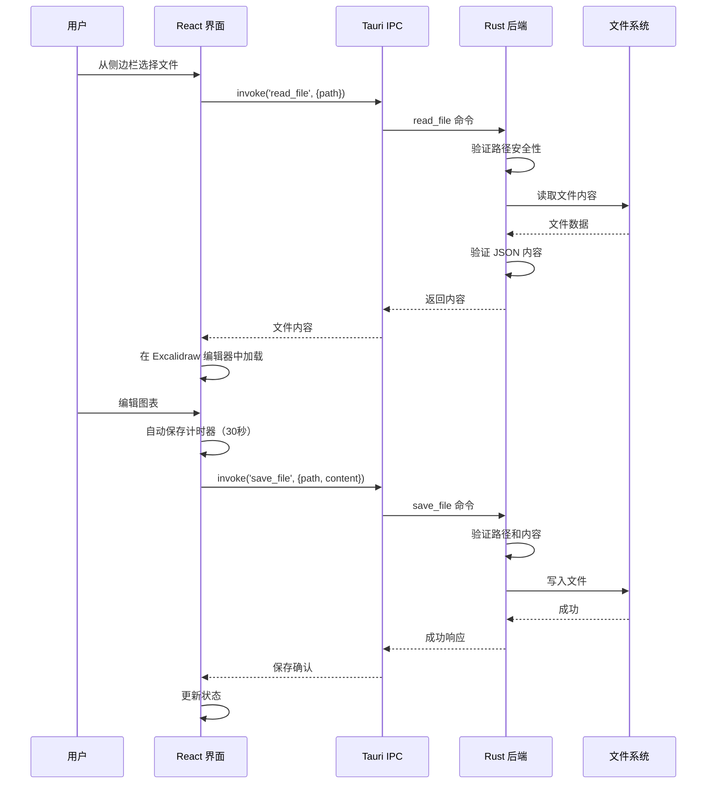

# ExcaliApp - Excalidraw 桌面编辑器

一款免费开源的桌面应用程序，用于管理和编辑本地 Excalidraw 文件。基于 Tauri 构建，提供原生桌面体验，同时保持熟悉的 Excalidraw 界面。

## 功能特性

- 📁 **本地文件管理**：直接从文件系统浏览和组织您的 Excalidraw 文件
- 🎨 **完整的 Excalidraw 编辑器**：包含官方 Excalidraw 编辑器的完整绘图和图表功能
- 💾 **自动保存**：每 30 秒自动保存，永不丢失您的工作
- 🚀 **快速文件切换**：在多个图表之间快速导航
- 🌲 **树形视图导航**：分层文件浏览器，更好地组织文件
- 🎯 **原生菜单**：特定平台的菜单和键盘快捷键
- 🌓 **主题支持**：浅色、深色和系统主题选项
- 🔒 **安全优先**：路径验证和内容清理，确保文件操作安全

## 安装

### 下载预构建版本

*即将推出 - 预构建的二进制文件将在 Releases 部分提供*

### 从源代码构建

#### 前置要求

- [Node.js](https://nodejs.org/)（v18 或更高版本）
- [Rust](https://www.rust-lang.org/)（最新稳定版）
- 平台特定的开发工具：
  - **Windows**：Visual Studio Build Tools
  - **macOS**：Xcode Command Line Tools  
  - **Linux**：`build-essential`、`libwebkit2gtk-4.1-dev`、`libssl-dev`

#### 构建步骤

```bash
# 克隆仓库
git clone https://github.com/yourusername/excaliapp.git
cd excaliapp

# 安装依赖
npm install

# 开发模式（支持热重载）
npm run tauri dev

# 构建生产版本
npm run tauri build
```

构建的应用程序将位于 `src-tauri/target/release/bundle/` 目录中

## 使用指南

### 快速开始

1. **启动应用程序**：从应用程序文件夹打开 ExcaliApp 或运行可执行文件

2. **选择目录**：
   - 首次启动时，系统会提示您选择包含 Excalidraw 文件的文件夹
   - 应用程序会记住您上次选择的目录，以便后续会话使用
   - 使用 `文件 → 打开目录`（Ctrl/Cmd+O）随时更改目录

3. **创建或编辑文件**：
   - 点击"新建文件"或使用 `文件 → 新建文件`（Ctrl/Cmd+N）创建新图表
   - 点击侧边栏中的任何文件以打开编辑
   - 您的更改每 30 秒自动保存一次

4. **在文件之间导航**：
   - 使用树形视图侧边栏浏览文件结构
   - 点击文件夹以展开/折叠
   - 文件按文件夹优先，然后按字母顺序排序

### 键盘快捷键

| 操作 | Windows/Linux | macOS |
|------|--------------|-------|
| 新建文件 | Ctrl+N | Cmd+N |
| 打开目录 | Ctrl+O | Cmd+O |
| 保存 | Ctrl+S | Cmd+S |
| 另存为 | Ctrl+Shift+S | Cmd+Shift+S |
| 切换侧边栏 | Ctrl+B | Cmd+B |
| 退出 | Ctrl+Q | Cmd+Q |

### 文件操作

- **创建**：点击"新建文件"按钮或使用菜单/快捷键
- **重命名**：右键点击文件并选择"重命名"
- **删除**：右键点击文件并选择"删除"
- **自动保存**：文件每 30 秒自动保存一次，在文件之间切换时也会保存

## 架构设计

### 高层架构



### 组件交互流程



### 技术栈

- **桌面框架**：[Tauri 2.x](https://tauri.app/) - 基于 Rust 的原生桌面应用框架
- **前端框架**：[React 19](https://react.dev/) 配合 TypeScript
- **绘图引擎**：[@excalidraw/excalidraw](https://github.com/excalidraw/excalidraw)
- **构建工具**：[Vite](https://vitejs.dev/)
- **UI 组件**：[shadcn/ui](https://ui.shadcn.com/) 配合 [Tailwind CSS](https://tailwindcss.com/)
- **状态管理**：React hooks 配合本地存储持久化

### 安全特性

- **路径遍历保护**：所有文件路径都经过验证和规范化
- **文件类型验证**：只能读写 `.excalidraw` 文件
- **内容验证**：保存前验证 JSON 结构
- **沙盒文件访问**：Tauri 的安全模型限制文件系统访问

## 开发

### 项目结构

```
excaliapp/
├── src/                    # React 前端
│   ├── components/         # React 组件
│   │   ├── Sidebar.tsx    # 文件浏览器侧边栏
│   │   ├── TreeView.tsx   # 分层文件树
│   │   └── ExcalidrawEditor.tsx # 编辑器包装器
│   ├── hooks/             # 自定义 React hooks
│   ├── lib/               # 工具函数
│   └── App.tsx            # 主应用程序
├── src-tauri/             # Rust 后端
│   ├── src/
│   │   ├── main.rs        # 入口点
│   │   ├── lib.rs         # 核心逻辑和命令
│   │   ├── menu.rs        # 原生菜单设置
│   │   └── security.rs    # 安全验证
│   └── tauri.conf.json    # Tauri 配置
└── package.json           # Node 依赖
```

### 可用脚本

```bash
# 启动开发服务器
npm run dev

# 以开发模式运行 Tauri
npm run tauri dev

# 构建生产版本
npm run tauri build

# 类型检查
npm run type-check

# 格式化代码
npm run format
```

### 贡献

欢迎贡献！请随时提交 Pull Request。

1. Fork 仓库
2. 创建您的功能分支（`git checkout -b feature/amazing-feature`）
3. 提交您的更改（`git commit -m '添加一些很棒的功能'`）
4. 推送到分支（`git push origin feature/amazing-feature`）
5. 打开一个 Pull Request

## 许可证

MIT 许可证 - 详见 [LICENSE](LICENSE) 文件

## 致谢

- [Excalidraw](https://excalidraw.com/) 提供了出色的绘图引擎
- [Tauri](https://tauri.app/) 提供了桌面框架
- 开源社区的持续启发