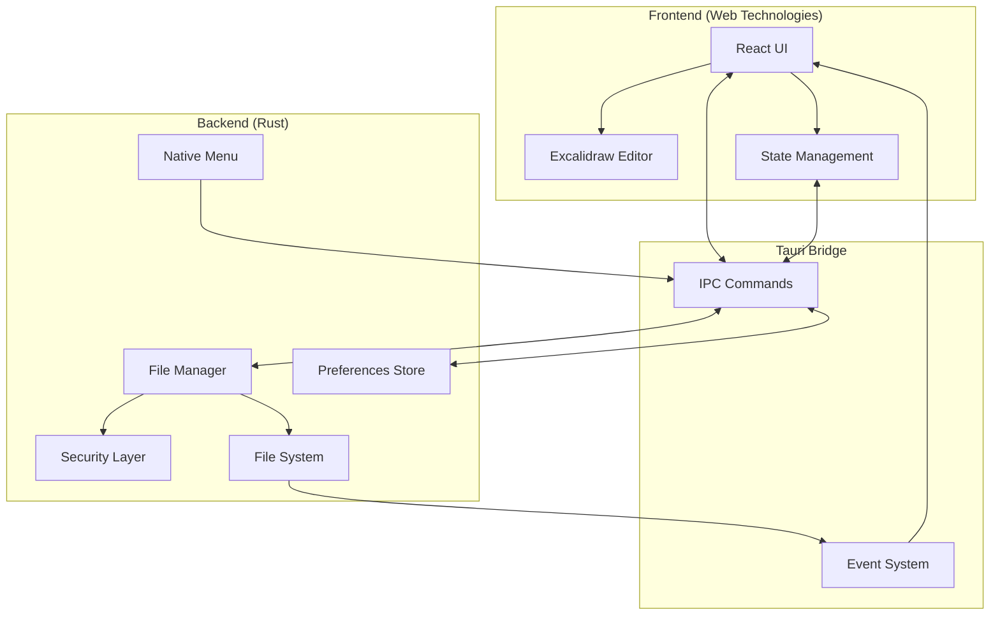
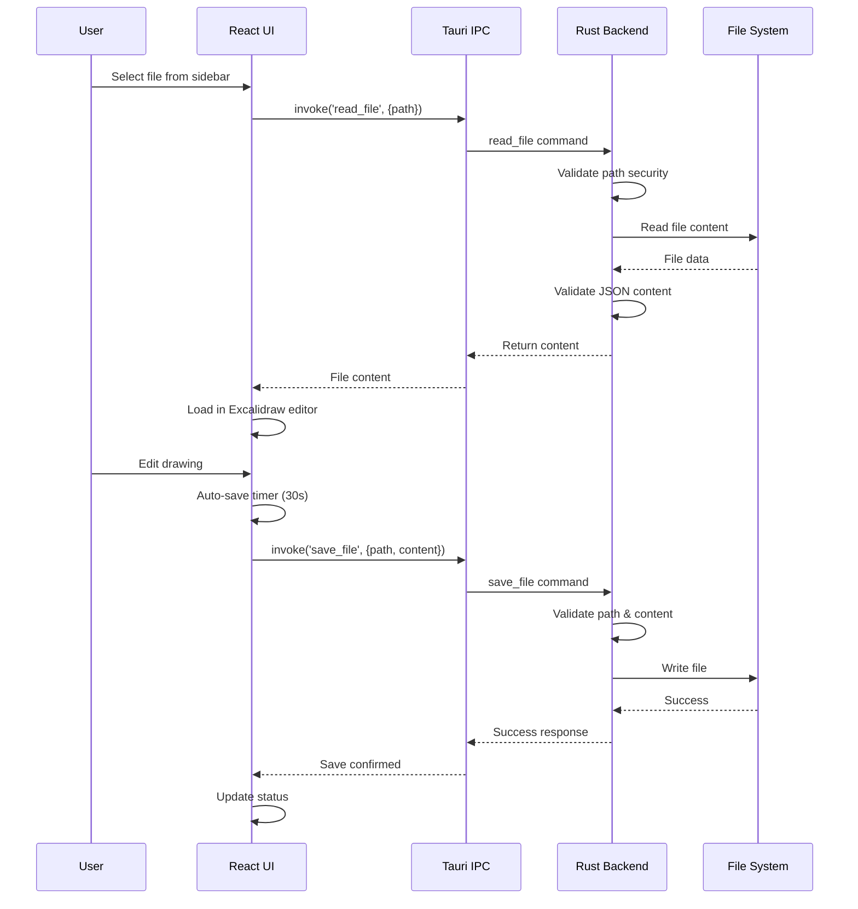

# ExcaliApp - Excalidraw Desktop Editor

A free, open-source desktop application for managing and editing local Excalidraw files. Built with Tauri for a native desktop experience while maintaining the familiar Excalidraw interface. See [中文说明](README-zh.md) for Chinese users.

## Features

- 📁 **Local File Management**: Browse and organize your Excalidraw files directly from your filesystem
- 🎨 **Full Excalidraw Editor**: Complete drawing and diagramming capabilities with the official Excalidraw editor
- 💾 **Auto-Save**: Never lose your work with automatic saving every 30 seconds
- 🚀 **Fast File Switching**: Quickly navigate between multiple drawings
- 🌲 **Tree View Navigation**: Hierarchical file browser for better organization
- 🎯 **Native Menus**: Platform-specific menus with keyboard shortcuts
- 🌓 **Theme Support**: Light, dark, and system theme options
- 🔒 **Security First**: Path validation and content sanitization for safe file operations

## Installation

### Download Pre-built Binaries

*Coming soon - Pre-built binaries will be available in the Releases section*

### Build from Source

#### Prerequisites

- [Node.js](https://nodejs.org/) (v18 or higher)
- [Rust](https://www.rust-lang.org/) (latest stable)
- Platform-specific development tools:
  - **Windows**: Visual Studio Build Tools
  - **macOS**: Xcode Command Line Tools
  - **Linux**: `build-essential`, `libwebkit2gtk-4.1-dev`, `libssl-dev`

#### Build Steps

```bash
# Clone the repository
git clone https://github.com/yourusername/excaliapp.git
cd excaliapp

# Install dependencies
npm install

# Development mode with hot reload
npm run tauri dev

# Build for production
npm run tauri build
```

The built application will be in `src-tauri/target/release/bundle/`

## Usage

### Getting Started

1. **Launch the Application**: Open ExcaliApp from your applications folder or run the executable

2. **Select a Directory**:
   - On first launch, you'll be prompted to select a folder containing your Excalidraw files
   - The app remembers your last selected directory for future sessions
   - Use `File → Open Directory` (Ctrl/Cmd+O) to change directories anytime

3. **Create or Edit Files**:
   - Click "New File" or use `File → New File` (Ctrl/Cmd+N) to create a new drawing
   - Click any file in the sidebar to open it for editing
   - Your changes are automatically saved every 30 seconds

4. **Navigate Between Files**:
   - Use the tree view sidebar to browse your file structure
   - Click on folders to expand/collapse them
   - Files are sorted with folders first, then alphabetically

### Keyboard Shortcuts

| Action         | Windows/Linux | macOS       |
| -------------- | ------------- | ----------- |
| New File       | Ctrl+N        | Cmd+N       |
| Open Directory | Ctrl+O        | Cmd+O       |
| Save           | Ctrl+S        | Cmd+S       |
| Save As        | Ctrl+Shift+S  | Cmd+Shift+S |
| Toggle Sidebar | Ctrl+B        | Cmd+B       |
| Quit           | Ctrl+Q        | Cmd+Q       |

### File Operations

- **Create**: Click "New File" button or use menu/shortcut
- **Rename**: Right-click on a file and select "Rename"
- **Delete**: Right-click on a file and select "Delete"
- **Auto-save**: Files are automatically saved every 30 seconds and when switching between files

## Architecture

### High-Level Architecture



### Component Interaction Flow



### Technology Stack

- **Desktop Framework**: [Tauri 2.x](https://tauri.app/) - Rust-based framework for building native desktop apps
- **Frontend Framework**: [React 19](https://react.dev/) with TypeScript
- **Drawing Engine**: [@excalidraw/excalidraw](https://github.com/excalidraw/excalidraw)
- **Build Tool**: [Vite](https://vitejs.dev/)
- **UI Components**: [shadcn/ui](https://ui.shadcn.com/) with [Tailwind CSS](https://tailwindcss.com/)
- **State Management**: React hooks with local storage persistence

### Security Features

- **Path Traversal Protection**: All file paths are validated and canonicalized
- **File Type Validation**: Only `.excalidraw` files can be read/written
- **Content Validation**: JSON structure is validated before saving
- **Sandboxed File Access**: Tauri's security model restricts file system access

## Development

### Project Structure

```
excaliapp/
├── src/                    # React frontend
│   ├── components/         # React components
│   │   ├── Sidebar.tsx    # File browser sidebar
│   │   ├── TreeView.tsx   # Hierarchical file tree
│   │   └── ExcalidrawEditor.tsx # Editor wrapper
│   ├── hooks/             # Custom React hooks
│   ├── lib/               # Utilities
│   └── App.tsx            # Main application
├── src-tauri/             # Rust backend
│   ├── src/
│   │   ├── main.rs        # Entry point
│   │   ├── lib.rs         # Core logic & commands
│   │   ├── menu.rs        # Native menu setup
│   │   └── security.rs    # Security validations
│   └── tauri.conf.json    # Tauri configuration
└── package.json           # Node dependencies
```

### Available Scripts

```bash
# Start development server
npm run dev

# Run Tauri in development mode
npm run tauri dev

# Build for production
npm run tauri build

# Type checking
npm run type-check

# Format code
npm run format
```

### Contributing

Contributions are welcome! Please feel free to submit a Pull Request.

1. Fork the repository
2. Create your feature branch (`git checkout -b feature/amazing-feature`)
3. Commit your changes (`git commit -m 'Add some amazing feature'`)
4. Push to the branch (`git push origin feature/amazing-feature`)
5. Open a Pull Request

## License

MIT License - see [LICENSE](LICENSE) file for details

## Acknowledgments

- [Excalidraw](https://excalidraw.com/) for the amazing drawing engine
- [Tauri](https://tauri.app/) for the desktop framework
- The open-source community for continuous inspiration
